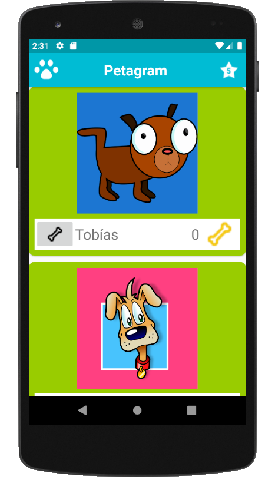
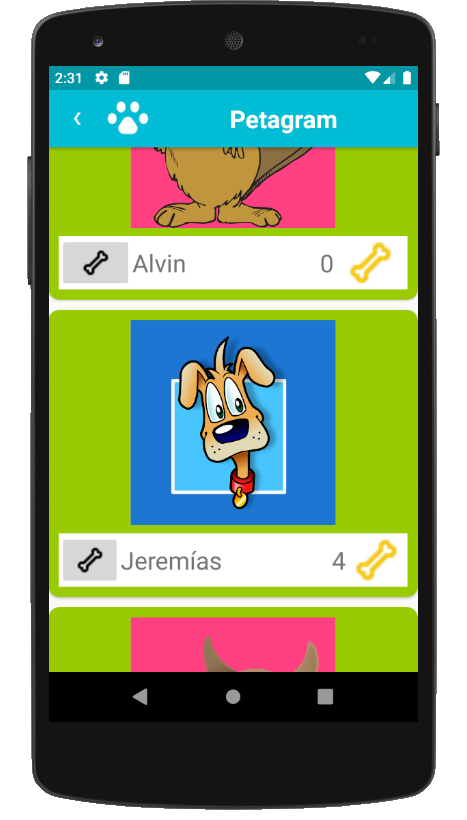

# Descripción
Assignment semana 3 curso Desarrollo de aplicaciones con Android (Coursera).

https://www.coursera.org/learn/desarrollo-de-aplicaciones

# Objetivos
Crear aplicación estilo Instagram que permita hacer likes a fotos de mascotas.

Características principales
  - Utilización de RecyclerView en MainActivity para mostrar lista de mascotas.
  - Cada mascota dispone de un botón "like" (hueso blanco) y de un icono (hueso amarillo) indicando número de likes.
  - Cada click sobre el botón del hueso blanco incrementa el número de likes (contador en icono hueso amarillo).
  - Creación de Action View (icono estrella) que lleva a una segunda activity (UltimasFavoritas) donde se mostrarán 5 mascotas "dummy" (en posteriores versiones se mostrarán las 5 últimas mascotas a las que se ha hecho "like").
  - Utilización de botón para regresar a actividad padre (subir).
  
# Consideraciones de implementación

  - Huella incorporada a actionbar.xml mediante atributo `app:logo`
  - Flecha de subir modificada mediante la siguiente instrucción en UltimasFavoritas.java:
```java
        miActionBar.setNavigationIcon(R.drawable.back);
```
    
  - UltimasFavoritas reordena aleatoriamente la ArrayList\<Mascota> mascotas. Como es dummy, no debe mostrar las últimas reateadas.
  - En UltimasFavoritas se muestra el hueso blanco por reutilizar el CardView, pero no se le asigna funcionalidad, aunque se clicke no cambia el número de likes de la mascota en esa activity.
    
# Capturas de pantalla
## MainActivity

## UltimasFavoritas

